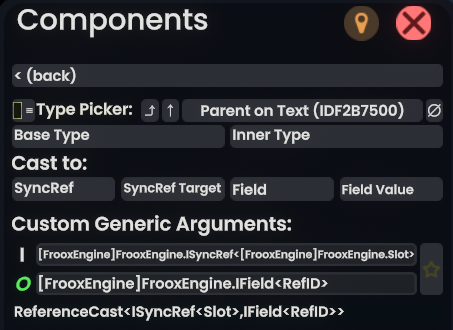

Type Picker
===========

A [MonkeyLoader](https://github.com/MonkeyModdingTroop/MonkeyLoader) mod for [Resonite](https://resonite.com/) adds a type picker into Component Selector / ProtoFlux Node Selector by utilizing [Component Selector Additions](https://github.com/ResoniteModdingGroup/ComponentSelectorAdditions).

Just drop any reference into the picker and choose the type

## Install
First, make sure you've installed MonkeyLoader and the necessary GamePacks - combined releases can be found on the page of the Resonite GamePack here: https://github.com/ResoniteModdingGroup/MonkeyLoader.GamePacks.Resonite/releases/  
You also need to install [Component Selector Additions](https://github.com/ResoniteModdingGroup/ComponentSelectorAdditions/releases).

Then all you have to do is placing the provided `TypePicker.nupkg` into your `Resonite/MonkeyLoader/Mods/` folder.  